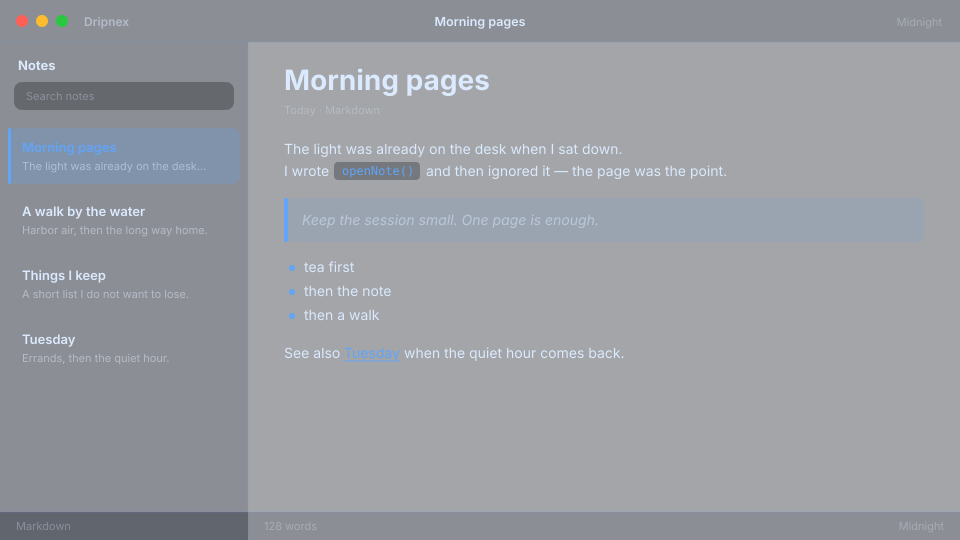

# Midnight

OLED navy with an electric blue pulse. Frosted, late, focused.



```
dripnex/theme-midnight
```

## Palette

The chips live in [palette.html](palette.html) — open it in a browser. GitHub won’t paint HTML swatches here, so the hex list is below.

| Name | Token | Color | What it’s for |
| --- | --- | --- | --- |
| Base | `--bg-base` | `#020612 · rgba(2, 6, 18, 0.2)` | Window background |
| Surface | `--bg-surface` | `#060c1c · rgba(6, 12, 28, 0.32)` | Sidebar and chrome |
| Elevated | `--bg-elevated` | `#0a1630 · rgba(10, 22, 48, 0.42)` | Raised panels |
| Text | `--text-primary` | `#dbeafe` | Headings and body |
| Muted | `--text-muted` | `#dbeafe · rgba(219, 234, 254, 0.5)` | Secondary copy |
| Accent | `--accent` | `#60a5fa` | Selection and links |
| Active | `--status-active` | `#60a5fa` | Active status |
| Dropped | `--status-dropped` | `#f87171` | Dropped status |

Pick it for OLED nights when you still want a clear blue accent.
